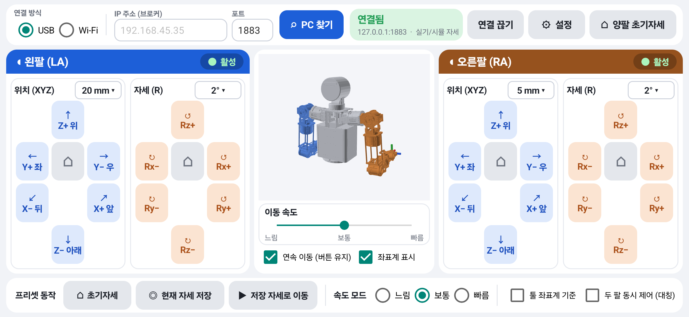

# phone_teleop

안드로이드 폰으로 휴머노이드 상체 양팔(RA/LA, 각 7축)을 조그 조작하는 텔레오퍼레이션입니다.
**IK는 폰에서 풀고, 폰이 로봇의 MQTT 지령 토픽으로 직접 발행합니다.** 지금은 PC의 MuJoCo 시뮬레이션이 로봇 역할을 합니다.



```
[폰 앱] 조그 패드(양팔 동시) → 목표 자세 → DLS IK(실기 관절 한계) → q(14)
   │     3D 뷰: 실제 CAD 메쉬를 폰 FK로 실시간 표시
   │ MQTT pub /humanoid/upper/cmd/joint   [0,0, LA q1..q7, RA q1..q7, servo]  50 Hz
   │      sub /humanoid/upper/joint_state  → 연결 시 현재 자세에서 시작
   ▼
[브로커]  USB: PC :1883 ← adb reverse ← 폰 127.0.0.1   ·   Wi-Fi: PC IP(비컨 자동 탐색) 또는 실기 브로커
   ▼
[teleop_sim.py] 지령 검증 → MuJoCo 위치 서보 → joint_state 발행   (실기에서는 humanoid_mqtt_bridge 가 이 자리)
```

## 구성

| 폴더 | 내용 |
|---|---|
| [`teleop/`](teleop/) | 폰 앱(Java, Gradle 없이 빌드), PC 브로커·시뮬, 폰 코드 검증 도구. **사용법·안전 설계·검증 결과는 [teleop/README.md](teleop/README.md)** |
| [`mujoco/`](mujoco/) | RecurDyn 모델에서 생성한 MuJoCo 모델(MJCF, URDF, STL)과 손목 평행링크 루프 유틸 |
| [`recurdyn/`](recurdyn/) | RecurDyn 원본: `HumanoidUpperBody.rmd`(기구학·질량의 단일 진실원), `.rdyn`(V9R5), `.x_t`(Parasolid CAD) |
| [`docs/`](docs/) | 폰 텔레오퍼레이션 검토 문서와 변경 이력 |

## 빠른 시작

```powershell
pip install mujoco numpy
cd teleop
python android\build_apk.py --install        # Android SDK + Android Studio JBR 필요
python broker.py                              # MQTT 브로커 :1883 (+ adb reverse, UDP 비컨)
python teleop_sim.py --broker 127.0.0.1 --publish-state --no-usb --no-wifi    # 시뮬 + 뷰어
```

폰 앱(가로 화면)에서 USB 또는 Wi-Fi(**PC 찾기**)를 고르고 **연결**합니다. 앱이 시뮬 자세로 동기화한 뒤 발행을 시작하고, 버튼을 누르는 동안 팔이 움직입니다.
폰 없이 시험하려면 `python fake_phone.py` 를 실행합니다. 폰 Java 코드의 FK·IK·조그 로직은 `python tools\check_phone_kinematics.py` 로 MuJoCo와 대조합니다.

## 주요 기능

- **조그**: 왼쪽 패널이 LA, 오른쪽 패널이 RA입니다. 위치(X±·Y±·Z±)와 자세(Rx±·Ry±·Rz±)를 **여러 손가락으로 동시에** 누를 수 있습니다.
  연속 이동과 스텝 이동(mm·° 단위 선택), 속도 슬라이더, base·툴 좌표계, 양팔 대칭 제어, 프리셋(초기자세·저장·복귀)을 지원합니다.
- **IK**: DLS에 관절 한계 잠금을 더했습니다. 실기 측정 가동 범위를 쓰고, 따라갈 수 없으면 그 틱을 취소하고 멈춥니다(축 밖 이동 1 mm 미만).
  위치 버튼이 막히면 손끝 자세를 한 번 누를 때 최대 30°까지 양보합니다(설정에서 끌 수 있음).
- **안전**: 서보 플래그 기본값 0, `joint_state` 동기화 전에는 발행하지 않음, 모든 동작은 속도 제한이 걸린 연속 지령, 모든 손가락이 떨어지면 전체 조그 해제.

## 상태 (2026-10-06)

- 실제 폰(Galaxy A15)을 USB와 Wi-Fi로 각각 시뮬에 연결해 확인했습니다: 연속·스텝·초기자세 복귀·3손가락 동시 누르기·재연결 시 동기화. Galaxy S25에도 설치했습니다.
- **실기 로봇에서는 아직 시험하지 않았습니다.** 관절축 14개가 제어기와 같은 것은 확인했지만, 엔코더 영점이 모델과 같은지는 첫 연결 때 서보 0 상태에서 3D 뷰와 실물을 비교해 확인해야 합니다. 절차는 [teleop/README.md](teleop/README.md#실기에-붙일-때)에 있습니다.
- **폰은 한 번에 한 대만 연결**합니다(MQTT에는 발행자 중재가 없음).
- 아직 없는 것: 팔끼리·몸통과의 충돌 회피, USB 연결로 실기 브로커까지 중계, 여러 폰 사이의 제어권 중재.

## 참고

- `mujoco/`의 모델 생성·검증 스크립트(`rmd_to_urdf.py`, `verify.py`)는 원래 작업공간의 다른 폴더(`chrono/`, `params/`, 메쉬 원본)가 필요해서 이 저장소만으로는 돌지 않습니다. 생성된 모델은 그대로 쓸 수 있습니다.
- 확인한 환경: Windows 11, Python 3.14, MuJoCo 3.13, Android SDK 35/36, Android 16 기기.
- 단위: RecurDyn 모델은 MMKS, MuJoCo 모델·코드·MQTT는 SI(m, rad).
