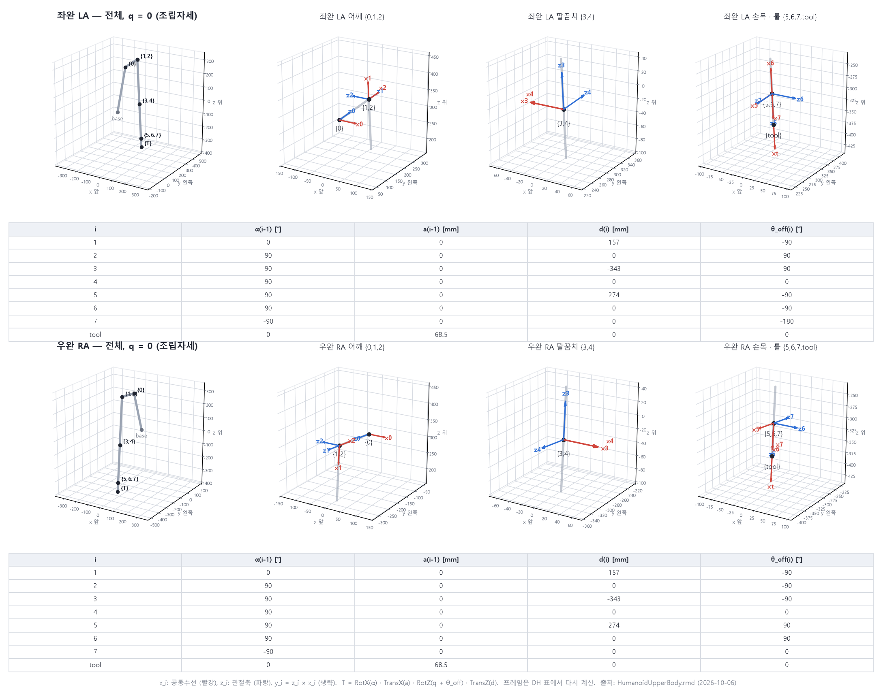
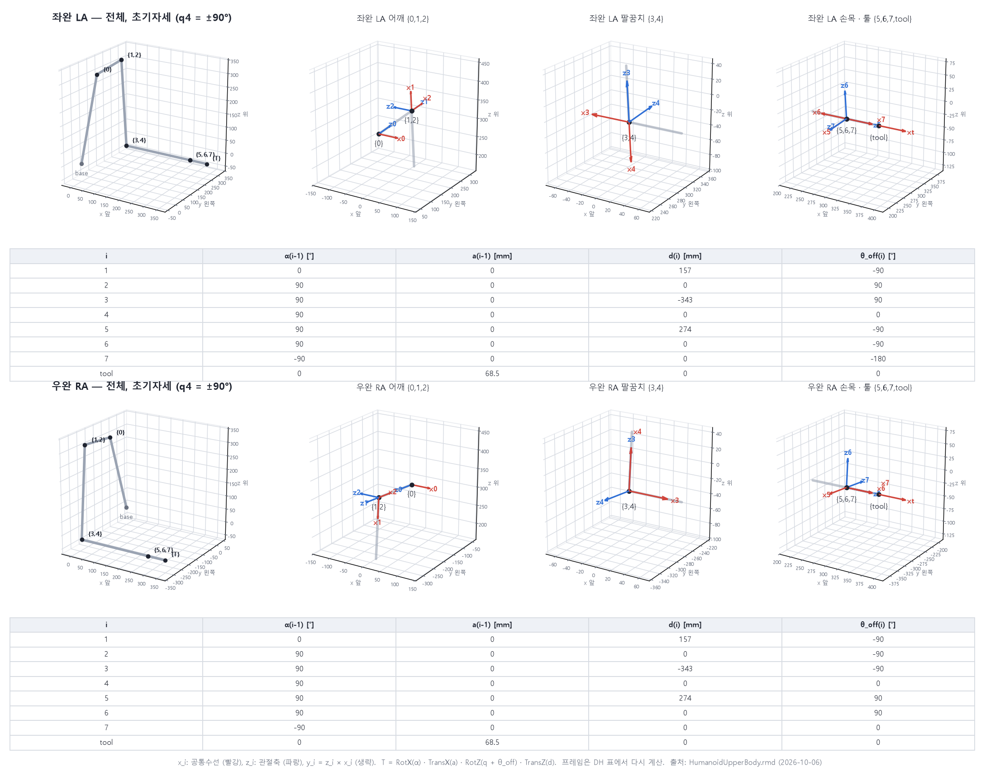

# 상체 양팔 기구학 — DH 파라미터, 관절 규약, 간섭 기반 구동 범위

출처는 `HumanoidUpperBody.rmd` 하나입니다(2026-10-06 01:49 저장본). 숫자를 손으로 옮겨 적은 곳은 없습니다.
DH는 `dh_export.py`가, 구동 범위는 `rom/`이 RecurDyn에서 직접 계산합니다.

## 1. 좌표계와 관절

- **로봇 베이스 좌표계**: x 앞, y 왼쪽, z 위. 단위 mm, deg(코드·MQTT는 m, rad).
- **팔 기준 좌표계 {0}**: 팔 서브시스템 좌표계(`body0`). 어깨가 바깥으로 5° 기울어진 장착이라 x축 기준으로 ±95°만큼 돌아가 있습니다.

| 팔 | T_base_0 위치 [mm] | T_base_0 회전 |
|---|---|---|
| RA | (0, −103.2769, 299.9862) | Rx(+85°): `[[1,0,0],[0,0.087156,−0.996195],[0,0.996195,0.087156]]` |
| LA | (0, +103.2769, 299.9862) | Rx(−85°): `[[1,0,0],[0,0.087156,0.996195],[0,−0.996195,0.087156]]` |

| q | 관절 | RA 모듈 | LA 모듈 | MQTT 배열 인덱스 (RA / LA) |
|---|---|---|---|---|
| q1 | 어깨 Pitch | M2 | M9 | 9 / 2 |
| q2 | 어깨 Roll | M3 | M10 | 10 / 3 |
| q3 | 어깨 Yaw | M4 | M11 | 11 / 4 |
| q4 | 팔꿈치 Pitch | M5 | M12 | 12 / 5 |
| q5 | 손목 Roll | M6 | M13 | 13 / 6 |
| q6 | 손목 Yaw | M7 | M14 | 14 / 7 |
| q7 | 손목 Pitch | M8 | M15 | 15 / 8 |

모듈과 인덱스는 `humanoid_control/Mqtt/TOPICS.md`, 관절 이름은 `motion_generation/rom/README.md`(부품 이름 근거)를 따릅니다.

## 2. Modified DH (Craig)

```
T_0^tool = Π_i  RotX(α_{i−1}) · TransX(a_{i−1}) · RotZ(θ_i) · TransZ(d_i),      θ_i = q_i + θ_off_i
```

q_i는 rmd의 관절각입니다(J 마커 대비 I 마커의 z축 회전). 마지막 줄 `tool`은 손끝 사이트(`body7.Cij`)이며 관절이 없습니다.

**우완 RA**

| i | α(i−1) [°] | a(i−1) [mm] | d(i) [mm] | θ_off(i) [°] |
|---|---|---|---|---|
| 1 | 0 | 0 | 157 | −90 |
| 2 | 90 | 0 | 0 | −90 |
| 3 | 90 | 0 | −343 | −90 |
| 4 | 90 | 0 | 0 | 0 |
| 5 | 90 | 0 | 274 | 90 |
| 6 | 90 | 0 | 0 | 90 |
| 7 | −90 | 0 | 0 | 0 |
| tool | 0 | 68.5 | 0 | 0 |

**좌완 LA**

| i | α(i−1) [°] | a(i−1) [mm] | d(i) [mm] | θ_off(i) [°] |
|---|---|---|---|---|
| 1 | 0 | 0 | 157 | −90 |
| 2 | 90 | 0 | 0 | 90 |
| 3 | 90 | 0 | −343 | 90 |
| 4 | 90 | 0 | 0 | 0 |
| 5 | 90 | 0 | 274 | −90 |
| 6 | 90 | 0 | 0 | −90 |
| 7 | −90 | 0 | 0 | −180 |
| tool | 0 | 68.5 | 0 | 0 |

### 그림

DH 표에서 프레임을 다시 계산해 그렸습니다(`dh_plot.py`). x_i(공통수선)는 빨강, z_i(관절축)는 파랑입니다.
같은 점에 겹친 프레임은 {1,2}처럼 묶어 표시하고, 어깨·팔꿈치·손목은 확대해서 따로 보여 줍니다.
초기자세에서 그림으로 계산한 손끝 위치는 (342.5, ∓289.57, −28.03) mm로 MuJoCo 모델과 같습니다.

**q = 0 (조립자세, θ_i = θ_off_i)**



**초기자세 (RA q4 = +90°, LA q4 = −90°)**



- 링크 치수: 어깨 오프셋 157, 상완 343, 전완 274, 손끝 68.5 mm. 연속한 관절축이 전부 한 점에서 만나서 a는 모두 0입니다(손끝 제외).
- **검증**: 양팔 모두 무작위 q 500개에서 DH로 계산한 손끝 자세와 모델(rmd → URDF)이 2.6e−15 이내로 일치합니다.
- **만드는 방법**: DH 프레임을 마커에서 읽지 않고 **관절축 직선에서 구성**합니다.
  z_i는 관절축 i, x_i는 축 i와 축 i+1의 공통수선입니다(부호는 α가 RA 템플릿과 같도록 고름). x_7은 손끝을 향합니다.
  - RA의 rmd 마커(`Ai`/`Cij`)는 이미 이 DH 프레임으로 편집되어 있어서, 축에서 구성한 표와 마커에서 읽은 표가 똑같습니다.
  - **LA의 마커는 DH 프레임이 아닙니다**(마커에서 직접 읽으면 잔차 1.0). 그래서 위 LA 표는 축에서 구성한 값입니다.
- 질량·관성은 다루지 않습니다. RightArm의 일부 CM 마커는 DH 편집 때 같이 움직여서 아직 수정이 필요합니다.

## 3. 관절 규약 — 실기 제어기, 폰 앱과의 관계

q=0일 때 베이스 좌표계에서 본 관절축입니다.

| q | 현재 rmd RA | 현재 rmd LA | 실기 제어기 · 폰 앱 · 9/28 MuJoCo |
|---|---|---|---|
| q1 | (0, −0.9962, 0.0872) | (0, 0.9962, 0.0872) | 같음 |
| q2 | (−1, 0, 0) | (−1, 0, 0) | 같음 |
| q3 | (0, 0.0872, 0.9962) | (0, −0.0872, 0.9962) | 같음 |
| q4 | (0, −0.9962, 0.0872) | (0, 0.9962, 0.0872) | 같음 |
| q5 | (0, −0.0872, −0.9962) | (0, 0.0872, −0.9962) | 같음 |
| q6 | (1, 0, 0) | (1, 0, 0) | 같음 |
| q7 | **(0, 0.9962, −0.0872)** | **(0, −0.9962, −0.0872)** | **반대** (RA (0, −0.9962, 0.0872), LA (0, 0.9962, 0.0872)) |

- **q1~q6**: 축과 영점이 실기 제어기(`TcUpperBodyControl/arm_model.h`)와 같습니다. q=0 손목 중심이 양쪽 모두 **(0, ∓313.45, −300.98) mm**입니다
  (`upper_control/kinematics_check.md`에 적힌 `arm_model.h` 값).
  `kinematics_check.md`의 "어깨 롤 5° 영점 차"는 **SolidWorks URDF와 제어기 사이**의 차이이고, rmd는 제어기 쪽과 같습니다.
- **q7**: 2026-10-06에 RightArm·LeftArm의 q7 축을 뒤집는 편집이 rmd에 들어가 있습니다(RA α6 = −90°가 되도록).
  그래서 **현재 rmd의 q7 = −(실기 제어기 q7)** 입니다. 폰 앱과 시뮬은 아직 예전(제어기) 규약을 씁니다.
  둘 중 한쪽으로 맞추기 전에는, 이 rmd에서 만든 값을 실기 q7에 쓸 때 부호를 바꿔야 합니다.
- 손목 평행링크(`body6_1`, `body6_2`)는 q6의 수동 링크입니다. 평행사변형이라 `joint6_1 = −q6`, `joint6_2 = +q6`(0.2° 이내)입니다.

## 4. 간섭 기반 모듈 구동 범위 (RecurDyn, 2026-10-06)

RecurDyn이 CAD 솔리드끼리 간섭을 직접 계산합니다.
축 하나만 돌리고 나머지 13축은 조립자세(q = 0)에 둔 채, 다른 부품과 **2.5 mm 여유** 안으로 들어가는 각도를 0.5° 분해능으로 찾습니다.
모델은 `HumanoidUpperBody.rdyn` 2026-10-06 03:00 저장본입니다(저장소 `recurdyn/`에 같은 파일).
각도는 **실기 제어기 규약**이고, 현재 rmd 규약에서는 q7만 부호가 반대입니다(q7 범위가 대칭이라 숫자는 같음).

| 팔 | q | 관절 | 모듈 | 하한 [°] | 상한 [°] | 하한을 막는 부품 | 상한을 막는 부품 | 9/3 측정 | 실기 적용 |
|---|---|---|---|---|---|---|---|---|---|
| RA | q1 | 어깨 Pitch | M2 | 간섭 없음 | 간섭 없음 |  |  | 없음 ~ 없음 | -90.00 ~ +90.00 |
| RA | q2 | 어깨 Roll | M3 | -22.97 | 간섭 없음 | body3.어깨_Yaw_팔꿈치_연결부_B_260423_URDF ↔ base.C1_Body_Part07_260515 |  | -22.97 ~ 없음 | -22.97 ~ +90.00 |
| RA | q3 | 어깨 Yaw | M4 | 간섭 없음 | 간섭 없음 |  |  | 없음 ~ 없음 | -90.00 ~ +90.00 |
| RA | q4 | 팔꿈치 Pitch | M5 | -23.44 | +91.88 | body4.팔꿈치_Pitch_회전부2_260427_URDF ↔ body3.팔꿈치_스토퍼_260424_URDF | body4.팔꿈치_Pitchl베어링_고정파트_URDF기본 ↔ body3.어깨_Yaw_팔꿈치_연결부_260423_URDF | -23.44 ~ +91.88 | -23.44 ~ +91.88 |
| RA | q5 | 손목 Roll | M6 | 간섭 없음 | 간섭 없음 |  |  | 없음 ~ 없음 | -90.00 ~ +90.00 |
| RA | q6 | 손목 Yaw | M7 | -48.84 | +103.69 | body6.C1_손목_Pitch_링크고정부2_260408 ↔ body5.손목_Roll_회전부3_260409_v2_URDF | body7.C1_손목_Pitch_회전부_260415_URDF ↔ body5.손목_샤프트_260408_URDF1 | -103.69 ~ +48.84 | -103.69 ~ +48.84 |
| RA | q7 | 손목 Pitch | M8 | -117.19 | +117.19 | body7.C1_손목_Pitch_회전부2_260415_URDF ↔ body5.손목_Roll_회전부2_260409_v2_URDF | body7.C1_손목_Pitch_회전부2_260415_URDF ↔ body5.손목_Roll_회전부3_260409_v2_URDF | -117.19 ~ +117.19 | -117.19 ~ +117.19 |
| LA | q1 | 어깨 Pitch | M9 | 간섭 없음 | 간섭 없음 |  |  | 없음 ~ 없음 | -90.00 ~ +90.00 |
| LA | q2 | 어깨 Roll | M10 | 간섭 없음 | +22.97 |  | body3.어깨_Yaw_팔꿈치_연결부_B_260423_URDF ↔ base.C1_Body_Part07_260515 | 없음 ~ +22.97 | -90.00 ~ +22.97 |
| LA | q3 | 어깨 Yaw | M11 | 간섭 없음 | 간섭 없음 |  |  | 없음 ~ 없음 | -90.00 ~ +90.00 |
| LA | q4 | 팔꿈치 Pitch | M12 | -91.88 | +19.69 | body4.팔꿈치_Pitchl베어링_고정파트_URDF기본1 ↔ body3.어깨_Yaw_팔꿈치_연결부_260423_URDF | body4.팔꿈치_Pitch_회전부2_260427_URDF ↔ body3.팔꿈치_스토퍼_260424_URDF | -91.88 ~ +19.69 | -91.88 ~ +19.69 |
| LA | q5 | 손목 Roll | M13 | 간섭 없음 | 간섭 없음 |  |  | 없음 ~ 없음 | -90.00 ~ +90.00 |
| LA | q6 | 손목 Yaw | M14 | -103.69 | +48.84 | body7.C1_손목_Pitch_회전부_260415_URDF ↔ body5.손목_샤프트_260408_URDF | body6.C1_손목_Pitch_링크고정부2_260408_URDF ↔ body5.손목_Roll_회전부3_260526_v2_URDF | -48.84 ~ +103.69 | -48.84 ~ +103.69 |
| LA | q7 | 손목 Pitch | M15 | -117.19 | +117.19 | body7.C1_손목_Pitch_회전부2_260415_URDF ↔ body5.손목_Roll_회전부3_260526_v2_URDF | body7.C1_손목_Pitch_회전부2_260415_URDF ↔ body5.손목_Roll_회전부2_260409_v2_URDF | -117.19 ~ +117.19 | -117.19 ~ +117.19 |

- **간섭 없음**은 ±180° 안에서 닿는 부품이 없다는 뜻입니다. 이 축들의 실제 범위는 형상이 아니라 액추에이터·케이블·사양이 정합니다.
  실기 적용 열의 ±90°는 그렇게 정한 **가정값**입니다(`upper_control/workorder.md`).
- q4 하한(RA) / 상한(LA)을 막는 `팔꿈치_스토퍼`는 설계된 기계식 하드스톱입니다.
- q2는 팔을 몸통 쪽으로 모으는 방향(RA −, LA +)에서 어깨 연결부가 몸통(`base.C1_Body_Part07`)에 닿습니다.

### ⚠️ q6(손목 Yaw)이 9월 측정과 방향이 반대입니다

| | RA q6 | LA q6 |
|---|---|---|
| 2026-09-03 모델 (실기 적용값의 출처) | −103.69 ~ +48.84 | −48.84 ~ +103.69 |
| **2026-10-06 모델** | **−48.84 ~ +103.69** | **−103.69 ~ +48.84** |

막는 부품 쌍은 같고(`손목_Pitch_링크고정부2` ↔ `손목_Roll_회전부3`, `손목_Pitch_회전부` ↔ `손목_샤프트`) 방향만 바뀌었습니다.
원인은 **손목 형상 변경**입니다. 바디별 박스를 비교하면 body0~body5는 9월과 같고, body6·body7·평행링크(body6_1, body6_2)만 옮겨졌습니다.
특히 평행링크 `body6_1`이 손목 반대쪽으로 갔습니다(서브시스템 z 111~125 → 190~203 mm).
측정 오류가 아니라 CAD 변경이 그대로 반영된 결과입니다.

**실기 적용값(`teleop/joint_limits_robot.json`, 폰 앱이 씀)은 9월 형상 기준입니다.**
실물 손목이 새 형상이라면 RA q6 −48.8° 아래, LA q6 +48.8° 위에서 간섭이 납니다. 실물이 어느 쪽인지 확인한 뒤 한계를 고쳐야 합니다.

### 재현

```
python rom/prescreen.py 1                 # solid_boxes.csv(Geom.exe) → candidate_pairs.csv
python rom/run_pose.py --margin 2.5       # 14축, RecurDyn GUI에서 사본을 열어 측정 (recurdyn 락 필요)
python rom/make_table.py                  # → rom_table.md, rom_limits.json
```

- 측정 엔진은 `motion_generation/processnet/RomPose.exe` · `Geom.exe`(ProcessNet)이고, 소스는 `rom/processnet/`에 있습니다.
  방법과 함정(바디만 회전 가능, 끼워맞춤 쌍 제외, 2.5 mm를 고른 이유)은 `motion_generation/rom/README.md`에 정리되어 있습니다.
- 관절축 직선은 `params/arm_{RA,LA}.json`에서 옵니다. q1~q7의 축 직선은 현재 rmd와 같습니다(q7은 방향만 반대이고 직선은 같음).
